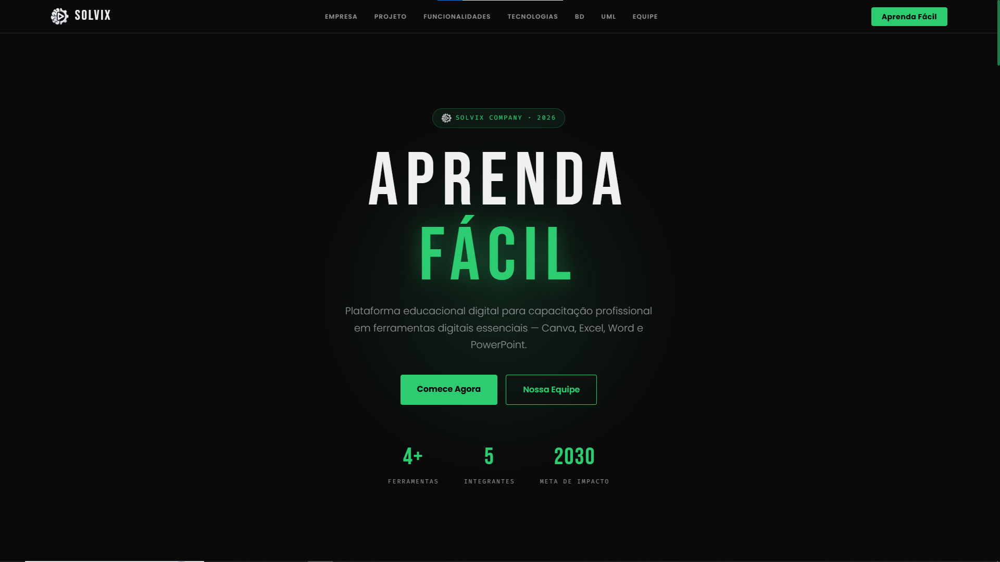
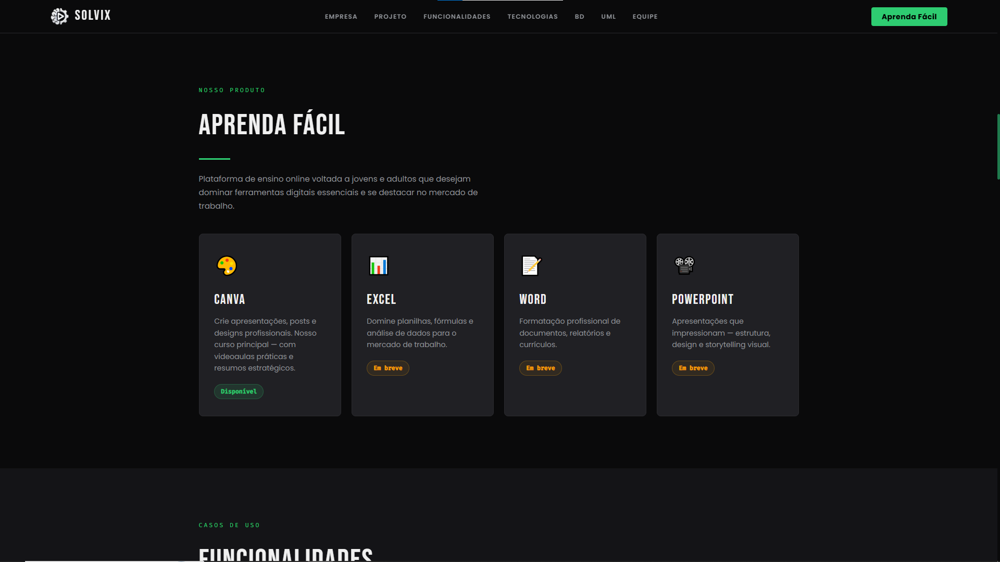
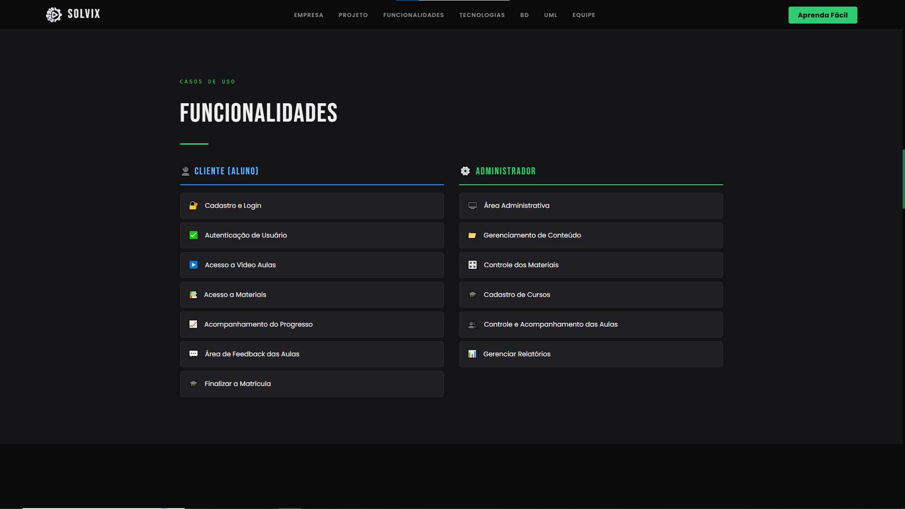
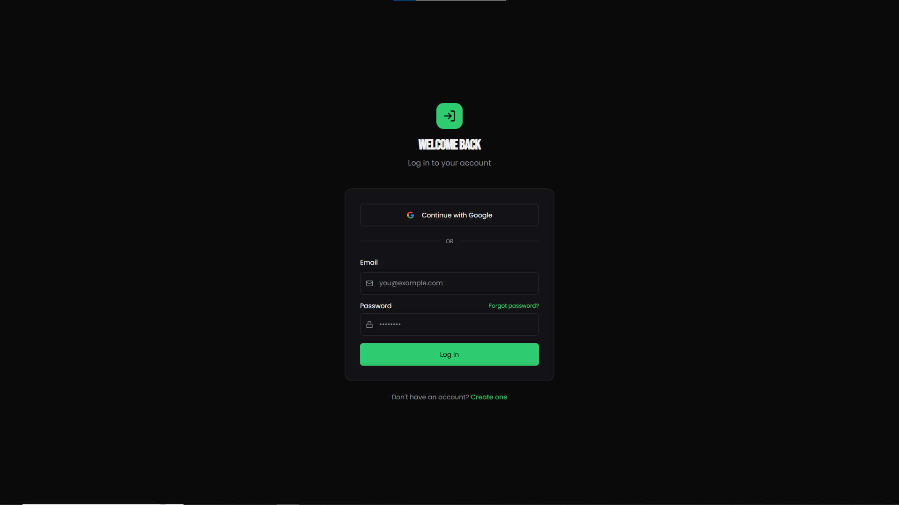
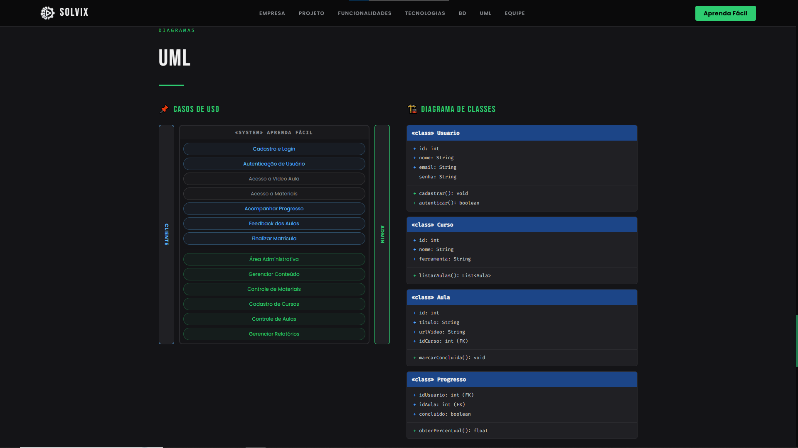
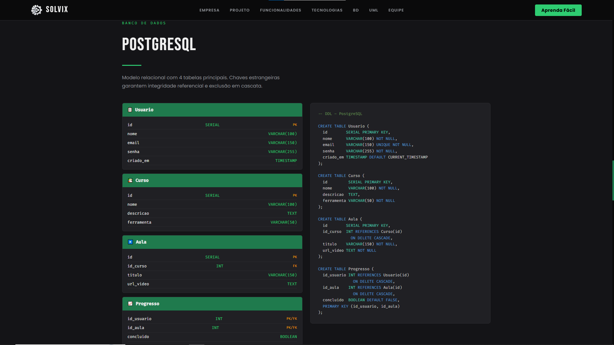

# Solvix Learn Flow

## Sobre o Projeto

O Solvix Learn Flow é um protótipo de plataforma educacional desenvolvido com o objetivo de centralizar cursos, materiais de estudo e ferramentas de aprendizagem em um único ambiente.

O projeto foi idealizado para facilitar o acesso ao conhecimento através de uma interface intuitiva e organizada, permitindo que estudantes encontrem conteúdos relevantes para seu desenvolvimento acadêmico e profissional.

---

## Objetivos

* Centralizar conteúdos educacionais.
* Facilitar o acesso a cursos online.
* Organizar materiais de estudo.
* Melhorar a experiência de aprendizagem dos usuários.

---

## Funcionalidades

* Catálogo de cursos
* Área de ferramentas de aprendizagem
* Sistema de navegação intuitivo
* Interface moderna e responsiva
* Estrutura preparada para futuras expansões

---

## Tecnologias Utilizadas

* Base44
* UX/UI Design
* Prototipação Web
* Planejamento de Produto

---

## Tela Inicial

---

## Área de Cursos

---

## Funcionalidades

---

## Login

---

## Modelagem UML

---

## Estrutura SQL

---

## Melhorias Futuras

* Sistema de autenticação
* Banco de dados integrado
* Dashboard do aluno
* Recomendações personalizadas
* Controle de progresso
* Integração com plataformas educacionais

---

## Status do Projeto

Projeto em fase de prototipação (MVP).

---

## Autor

Ícaro Cruz

Estudante de Análise e Desenvolvimento de Sistemas.
